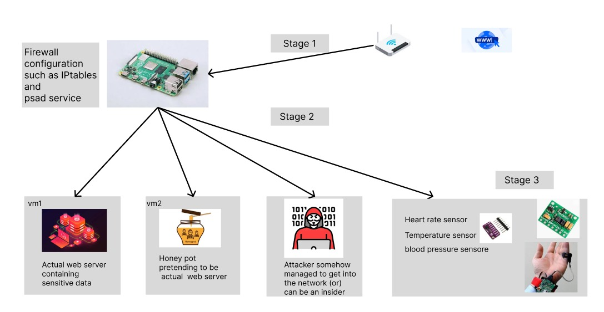

# Honeypot Architecture with Raspberry Pi

## Overview of the setup
This project sets up a honeypot using a Raspberry Pi to detect network attacks and redirect malicious traffic to a decoy server. The system is designed to:
- Detect port scans using **PSAD** (Port Scan Attack Detector)
- Redirect attackers to a honeypot (decoy server)
- Provide network connectivity through an **Access Point (AP)**
- Allocate dynamic IP addresses using **dnsmasq**
- Route legitimate sensor data to a secure web server

## Architecture Stack


## Configuration
The Raspberry Pi is configured to:
- Enable **SSH** on boot
- Automatically connect to a **Wi-Fi router** to obtain an IP address

## Stage 1: Network Intrusion Detection & Traffic Redirection
The Raspberry Pi uses its built-in Wi-Fi interface (**wlan0**) to connect to the network. Traffic is monitored, and firewall rules dictate how packets are processed.

### Constraints
- If a **port scan** is detected on any machine in the network, **PSAD** alerts the root user and redirects the attacker to the honeypot.

### PSAD Configuration (`psad.conf`)
```psad
ENABLE_AUTO_IDS Y;
ENABLE_AUTO_IDS_EMAILS N;
IPT_SYSLOG_FILE /var/log/syslog;
EXPECT_TCP_OPTIONS Y;
EXPECT_TCP_FLAGS Y;
AUTO_IDS_DANGER_LEVEL 3;
AUTO_BLOCKING_SCRIPT /etc/psad/redirect_to_honeypot.sh;
```

### Redirection Script (`redirect_to_honeypot.sh`)
```bash
#!/bin/bash
# Get the attacker's IP from PSAD
ATTACKER_IP=$1

# Redirect the attacker's HTTP traffic to the honeypot (port 80)
iptables -t nat -A PREROUTING -s $ATTACKER_IP -p tcp --dport 80 -j DNAT --to-destination 192.168.1.200

# Log the redirection
echo "$(date) - Redirected $ATTACKER_IP to honeypot" >> /var/log/honeypot_redirect.log
```

### IPTables Configuration
```iptables
# Flush existing rules
sudo iptables -F
sudo iptables -t nat -F

# Allow forwarding from Raspberry Pi to the network
sudo iptables -A FORWARD -i wlan0_ap -o wlan0_ap -j ACCEPT

# Default NAT for regular traffic (forward to actual server)
sudo iptables -t nat -A PREROUTING -d 192.168.2.222 -j DNAT --to-destination 192.168.1.100

# Redirect traffic from the attacker (X.X.X.X) to the honeypot
sudo iptables -t nat -A PREROUTING -s X.X.X.X -p tcp --dport 80 -j DNAT --to-destination 192.168.1.200

# Allow masquerading for outbound traffic
sudo iptables -t nat -A POSTROUTING -j MASQUERADE
```

## Stage 2: Setting Up a Wireless Access Point
The Raspberry Pi is configured to act as an **Access Point (AP)** using a virtual Wi-Fi interface (`wlan0_ap`).
```bash
sudo iw dev wlan0 interface add wlan0_ap type __ap
```

### Supported Interface Modes (Raspberry Pi 3B+)
```bash
Supported interface modes:
	* IBSS
	* managed
	* AP
	* AP/VLAN
	* monitor
	* mesh point
```

### DHCP Configuration with **dnsmasq**
`dnsmasq` provides **DHCP services**, assigning IP addresses to connected clients.
```dnsmasq
interface=wlan0_ap
dhcp-range=192.168.4.2,192.168.4.20,255.255.255.0,24h

domain-needed
bogus-priv
dhcp-option=3,192.168.4.1
dhcp-option=6,192.168.4.1
```

### Access Point Configuration with **Hostapd**
`hostapd` configures the Wi-Fi interface as an access point.
```Hostapd
interface=wlan0_ap
driver=nl80211
ssid=RaspberryPi3
hw_mode=g
channel=6
wmm_enabled=0
auth_algs=1
#wpa=2
#wpa_passphrase=12345678
#wpa_key_mgmt=WPA-PSK
#rsn_pairwise=CCMP
```

## Stage 3: Web Server Configuration
At this stage, two virtual machines (VMs) are set up:
1. **VM1 (Legitimate Web Server)**: Collects sensor data from authenticated users
2. **VM2 (Honeypot Web Server)**: Decoy system for attackers redirected by PSAD

### Network Configuration
- Both VMs use **bridged adapters** to allow direct communication.
- Sensor data from legitimate users is forwarded to **VM1** through the Raspberry Pi.
- If an attacker performs a **port scan**, **PSAD detects the activity** and reroutes their traffic to **VM2 (honeypot).**

## Summary
This project implements a **honeypot-based intrusion detection system** using a Raspberry Pi. It leverages **PSAD** to detect network attacks and dynamically redirects attackers to a honeypot environment, while maintaining secure communication for legitimate users.

### Technologies Used
- **Raspberry Pi 3B+**
- **PSAD** (Port Scan Attack Detector)
- **iptables** (Firewall Configuration)
- **dnsmasq** (DHCP Server)
- **hostapd** (Wireless Access Point Setup)
- **Linux Networking** (Bridged Adapter for VMs)

### Future Enhancements
- Implement logging and analytics for honeypot interactions.
- Automate reporting of detected attackers.
- Introduce more sophisticated honeypot deception techniques.
